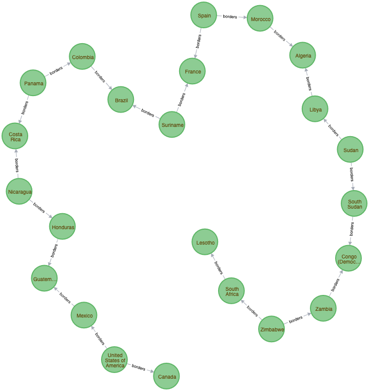
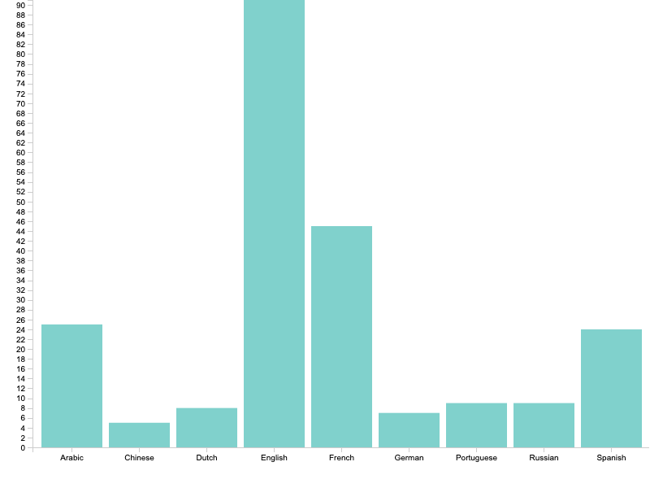
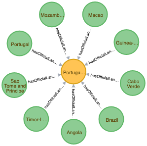

# How to transform a rest service to a graph service

While browsing the internet I stumbled upon an interesting [REST countries API](https://restcountries.eu/), it has a list of all the countries around the world with relevant data like regions, languages, currencies, bordering countries, timezones, location and some other cool stuff.

While using it, I was quite amazed how well it worked but I wondered how it could be better. I identified the following **limitations**:

1. **Data traversal** - I can only traverse the data in one direction, country per country but what if I want to know all the subregions in Europe? Which currencies do they use in African countries? Or the full name of bordering countries? To answer those questions, I have to do multiple requests or loop over the whole country list 

2. **Advanced searching** - It's possible to search by a couple of parameters but no advanced search scenario's like "give me all the countries with a population of 10 million or less" or "give me all the countries on the UTC timezone". 
3. **Over fetching** - It's possible to filter the output so that you don't have to query all country-related data but you can't filter out nested data like the symbol of a currency.

I don't think that the maintainers of REST countries should address these limitations. They are quite specific and natural to any traditional REST service. However, these limitations can easily be overcome by combining the power of Neo4j and GraphQL which effectively converts this REST service to a graph service.

Traversing a data tree in different directions is only natural for a graph database like Neo4j. Fetching only what you need is one of the core benefits of GraphQL. Advanced searching, filtering, sorting and pagination comes for free by using the awesome open-source [neo4j-graphql.js]( https://grandstack.io/docs/neo4j-graphql-js.html ) library.

I took the following steps to effectively transform REST countries to a graph service. However, the same theory could be applied to the REST service that you have in mind. You can explore the final result of the transformation in the [graph countries GitHub repo](https://github.com/lennertVanSever/graphcountries).

## Model the graph

To get started you will need to insert all the data from the REST service in the Neo4j graph database. Before you do that, take a step back and think about how you will structure your graph, just drawing some circles and lines with pen and paper or a whiteboard should do the trick, once you are done with that you can take your sketch to the next level with a tool like [draw.io]([draw.io]())


Deciding what should be a node, a property or a relationship can be tricky, what helps is to look at how the REST service is structured. Many-to-many or one-to-many relationships like objects in an array deserve separate nodes. Try to  name all your different types of nodes and relationships as soon as possible.

Most importantly, don't worry if you can't model your whole graph at this stage, graph databases are flexible and can easily be changed or extended at a later stage.

## Insert the data

There are multiple ways to insert data into a Neo4j instance. If you have a big data set, on the scale of 100mb+, you probably want to use something like [Neo4j admin import](https://neo4j.com/docs/operations-manual/current/tools/import/). If the data will only be inserted via a user interface, start with modelling a GraphQL schema and follow the [Neo4j GraphQL Quickstart](https://grandstack.io/docs/neo4j-graphql-js-quickstart.html).

In my use case, I already had all the necessary data and it was relatively small. With a NodeJS script, I looped over all the available countries and used the [Neo4j JavaScript driver](https://www.npmjs.com/package/neo4j-driver)  to execute my Cypher queries. I could have written my GraphQL schema first but I decided to use the full flexibility of custom Cypher queries

```javascript
await session.run(
  `
  MATCH(country: Country { name: $name })
  MERGE(subregion: Subregion { name: $subregion })
  MERGE(region: Region { name: $region })
  MERGE(country)-[:hasSubregion]->(subregion)
  MERGE(subregion)-[:hasRegion]->(region)
  `, {
    name, region, subregion
  }
)
```

The above query creates two different types of nodes and relationships. The `MERGE` clause assures that I won't have redundant nodes or relationships. Since the data set is so small, I have the luxury to drop the database and insert all the nodes and relationships again every time I execute [the script](https://github.com/lennertVanSever/graphcountries/blob/master/src/dataScraping/restCountries.js), making it really easy to make changes to my data model. 

## Expose the data

Now how do we expose a Neo4j database as a simple API to other applications? With the [neo4j-graphql.js]( https://grandstack.io/docs/neo4j-graphql-js.html ) library, you can easily create a GraphQL endpoint, it will handle resolvers and mutations for you and even the schema can be auto-generated by inferring GraphQL type definitions from your Neo4j database.

Let's walk through the setup:

Create a new directory and initiate a new node project

```bash
mkdir neo4j-graphql && cd neo4j-graphql && npm init -y
```


Install all the necessary dependencies

```bash
npm install dotenv apollo-server neo4j-driver neo4j-graphql-js
```


Create a `.env` file at the root of your project with the connection details of your Neo4j database 

```bash
BOLT_ADDRESS=bolt://localhost:7687
DB_USERNAME=neo4j
DB_PASSWORD=neo4j
```


Create an `index.js` file at the root of your project with the code to infer a GraphQL API from your Neo4j database

```javascript
require('dotenv').config()
const { ApolloServer } = require('apollo-server');
const neo4j = require('neo4j-driver');
const { inferSchema, makeAugmentedSchema } = require('neo4j-graphql-js');

const {
  BOLT_ADDRESS,
  DB_USERNAME,
  DB_PASSWORD
} = process.env;

(async () => {
  const driver = neo4j.driver(BOLT_ADDRESS, neo4j.auth.basic(DB_USERNAME, DB_PASSWORD));
  const { typeDefs } = await inferSchema(driver);

  const generatedSchema = makeAugmentedSchema({
    typeDefs,
  });
  
  const server = new ApolloServer({
    schema: generatedSchema,
    context: ({ req }) => {
      return {
        driver,
        req
      };
    },
  });
  const port = process.env.PORT || 8080;
  
  server.listen(port).then(({ url }) => {
    console.log(`GraphQL API ready at ${url}`);
  }).catch(err => console.error(err));
})();
```


Start your GraphQL API:

```bash
node index.js
```

Now you can explore your GraphQL API on http://localhost:8080. Don't forget to check out the docs, the search, filter and sorting options are extensive. If you like to extend your GraphQL schema with custom Cypher queries, you can always copy the inferred schema and use the [`@cypher` directive](https://grandstack.io/docs/neo4j-graphql-js.html)

```
type Country {
  "The population per square kilometer"
  populationDensity: Float
  @cypher(
    statement: """
      return this.population / this.area
    """
  )
  # ...
}
```


## Do some fun graph algorithms

Try to get some insights into your data by performing some graph algorithms. I found the following queries quite interesting:

The longest shortest path between all the bordering countries in the world is the following:




```cypher
MATCH (a:Country), (b:Country) WHERE id(a) > id(b)
MATCH p=shortestPath((a)-[:borders*]-(b))
WITH length(p) AS len, p
ORDER BY len DESC LIMIT 1
RETURN p
```


Top 10 languages that are used in different countries, notice how this correlates with the largest kingdoms in our recent history



```cypher
MATCH (country:Country)
MATCH (language:Language)
WITH country, language, SIZE(()-[:hasOfficialLanguage]-(language)) as countryCount
ORDER BY countryCount DESC
RETURN DISTINCT(language.name), countryCount
LIMIT 10
```


You can also discover interesting patterns by just browsing your graph, for example, countries with Portuguese as there official language never border each other.

 


## Conclusion

Thanks to the generated GraphQL API, I was able to overcome the limitations of the REST API:

* I can traverse the data tree in any direction, what are the subregions of Europe? [Here you go](https://countries-274616.ew.r.appspot.com/?query=query%20%7B%0A%09Region%28name%3A%20%22Europe%22%29%20%7B%0A%20%20%20%20subregions%20%7B%0A%20%20%20%20%20%20name%0A%20%20%20%20%7D%0A%20%20%7D%0A%7D%0A). Which currencies do they use in African countries? [No problem](https://countries-274616.ew.r.appspot.com/?query=query%20%7B%0A%09Region%28name%3A%20%22Africa%22%29%20%7B%0A%20%20%20%20name%0A%20%20%20%20subregions%20%7B%0A%20%20%20%20%20%20name%0A%20%20%20%20%20%20countries%28orderBy%3A%20name_asc%29%20%7B%0A%20%20%20%20%20%20%20%20name%0A%20%20%20%20%20%20%20%20currencies%20%7B%0A%20%20%20%20%20%20%20%20%20%20name%0A%20%20%20%20%20%20%20%20%20%20symbol%0A%20%20%20%20%20%20%20%20%7D%0A%20%20%20%20%20%20%7D%0A%20%20%20%20%7D%0A%20%20%7D%0A%7D%0A). What is the full name of the bordering countries? [Don't make it so easy](https://countries-274616.ew.r.appspot.com/?query=query%20%7B%0A%09Country%20%7B%0A%20%20%20%20name%0A%20%20%20%20borders%20%7B%0A%20%20%20%20%20%20name%0A%20%20%20%20%7D%0A%20%20%7D%0A%7D%0A). 
* The search, filter and sorting options are amazing. Give me all the countries with a population of 10 million or less. [All done and sorted by population](https://countries-274616.ew.r.appspot.com/?query=query%20%7B%0A%09Country%28filter%3A%20%7B%20population_lte%3A%2010000000%20%7D%2C%20orderBy%3A%20population_desc%29%20%7B%0A%20%20%20%20name%0A%20%20%20%20population%0A%20%20%7D%0A%7D%0A). Give me all the countries on the UTC timezone. [This is the result](https://countries-274616.ew.r.appspot.com/?query=query%20%7B%0A%09Timezone%28name%3A%20%22UTC%22%29%20%7B%0A%20%20%20%20name%0A%20%20%20%20countries%20%7B%0A%20%20%20%20%20%20name%0A%20%20%20%20%7D%0A%20%20%7D%0A%7D%0A).
* Because of the nature of GraphQL, I can query exactly what I want so no under or over fetching.

Next to an easy to use API, I can do some data analytics through graph algorithms to get some more insights into my domain.